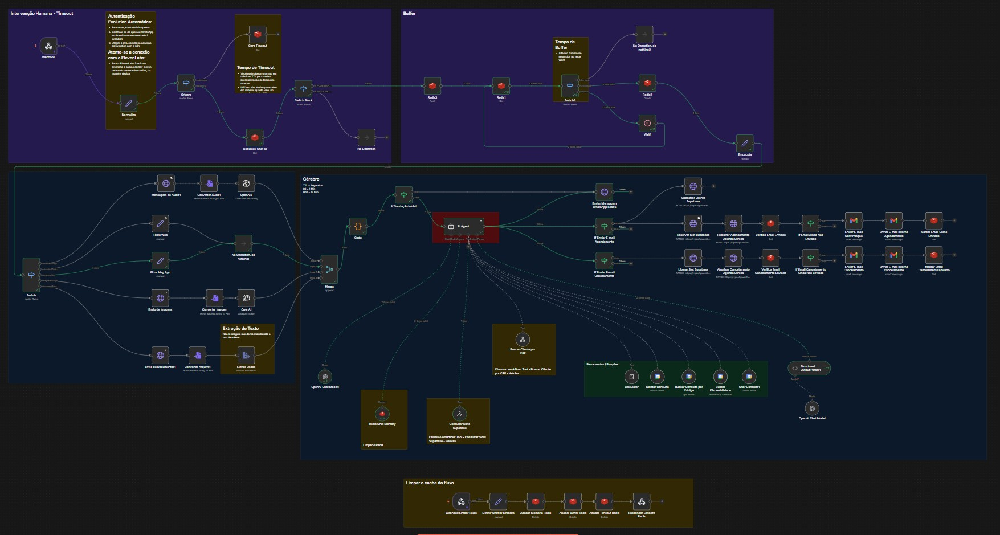

# Autonomous AI Orchestration System

Production-grade autonomous AI orchestration infrastructure integrating conversational agents, workflow automation, persistent memory, scheduling systems, and real-time multi-platform communication.

---

## Overview

This project demonstrates the architecture and orchestration of autonomous AI-driven systems capable of:

- Conversational workflow management
- Real-time scheduling automation
- Persistent memory handling
- Multi-service API orchestration
- Structured AI outputs
- State recovery and resilience
- WhatsApp communication flows
- Calendar synchronization
- Database-driven automation logic

The system was designed to operate under real-world production constraints with reliability, modularity, and scalability in mind.

---

## Core Technologies

- n8n
- Supabase
- Redis
- Google Calendar API
- WhatsApp API (Evolution API)
- Gmail API
- AI Agents
- Structured Output Parsing
- Workflow Orchestration
- Persistent Context Memory
- HTTP APIs
- Automation Infrastructure

---

## Architecture Highlights

### Autonomous AI Agents

Designed AI agents capable of:

- Multi-step reasoning
- Tool calling
- Context retention
- Structured output generation
- Conversational state management
- Dynamic workflow execution

---

### Workflow Orchestration

Implemented resilient orchestration flows integrating:

- Scheduling systems
- External APIs
- Database operations
- State persistence
- Error handling
- Automated confirmations
- Slot reservation systems

---

### Persistent Memory Infrastructure

Built memory-aware conversational systems using:

- Redis-based context persistence
- Stateful workflow continuity
- Session tracking
- Recovery logic
- Structured memory handling

---

## System Capabilities

- Autonomous scheduling flows
- Intelligent appointment management
- Real-time availability querying
- Multi-platform integrations
- Structured conversational pipelines
- AI-assisted workflow execution
- Dynamic API coordination
- Automated notification systems

---

## Engineering Focus

This project focuses heavily on:

- Systems engineering
- Reliability
- Automation architecture
- AI orchestration
- Scalable workflow design
- Real-world operational constraints
- Infrastructure integration
- Resilient conversational systems

---

## Status

Active and continuously evolving.

Additional architecture diagrams, workflow examples, and infrastructure documentation will be added progressively.
