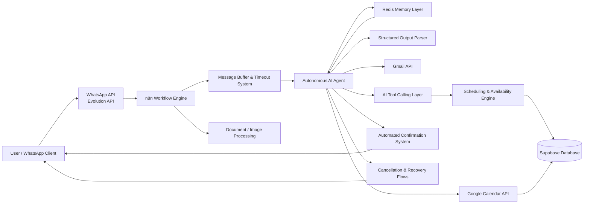

# System Architecture Diagram

```mermaid
flowchart LR

    USER[User / WhatsApp Client]

    WA[WhatsApp API<br>Evolution API]

    N8N[n8n Workflow Engine]

    AGENT[Autonomous AI Agent]

    MEMORY[Redis Memory Layer]

    PARSER[Structured Output Parser]

    SUPABASE[(Supabase Database)]

    GCAL[Google Calendar API]

    GMAIL[Gmail API]

    BUFFER[Message Buffer & Timeout System]

    TOOLS[AI Tool Calling Layer]

    SLOTS[Scheduling & Availability Engine]

    CONFIRM[Automated Confirmation System]

    CANCEL[Cancellation & Recovery Flows]

    DOCS[Document / Image Processing]

    USER --> WA

    WA --> N8N

    N8N --> BUFFER

    BUFFER --> AGENT

    AGENT --> MEMORY

    AGENT --> PARSER

    AGENT --> TOOLS

    TOOLS --> SLOTS

    SLOTS --> SUPABASE

    AGENT --> GCAL

    AGENT --> GMAIL

    AGENT --> CONFIRM

    AGENT --> CANCEL

    N8N --> DOCS

    GCAL --> SUPABASE

    CONFIRM --> USER

    CANCEL --> USER

    MEMORY --> AGENT
```
